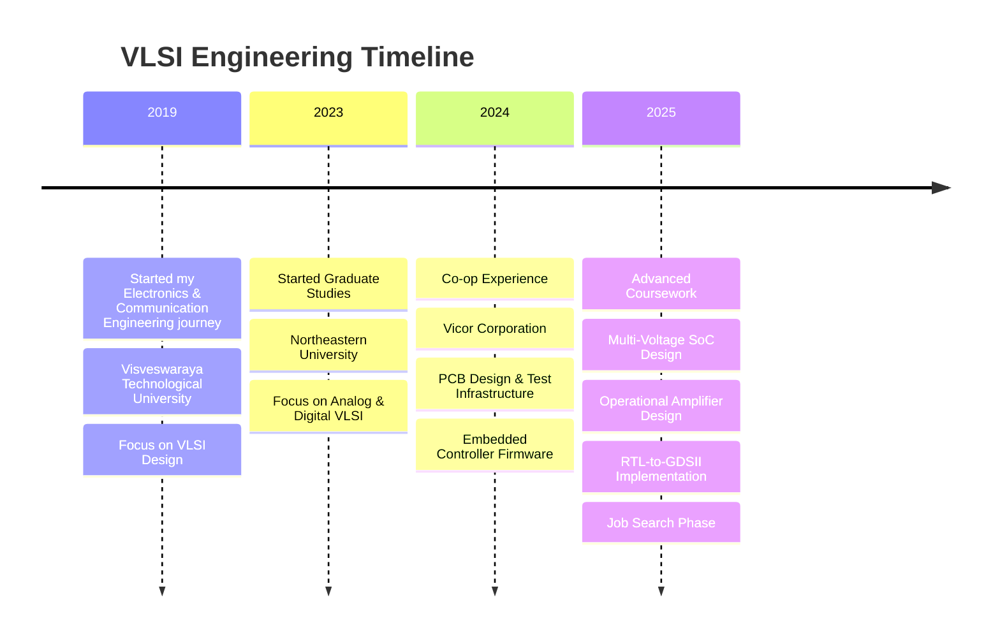

# ⚡ Welcome to My Digital Circuit Board ⚡

<div align="center">


```
┌─────────────────────────────────────────────────────────────-----------------┐
│                  _  ______  _   _ _____ _   _ ___                            │
│                 | |/ /  _ \| | | |_   _| | | |_ _|                           │
│                 | ' /| |_) | | | | | | | |_| || |                            │
│                 | . \|  _ <| |_| | | | |  _  || |                            │
│                 |_|\_\_| \_\\___/  |_| |_| |_|___|                           │
│                                                                              │
│        🎯 VLSI Enthusiast • RTL • Analog • Physical                          │
│        📍 Currently: Job Seeking (Dec 2025)                                  │
│        🔬 Research: Multi-Voltage SoC Implementation                         │
└─────────────────────────────────────────────────────────────-----------------┘

```

</div>

## 🔌 Terminal Interface

```bash
kruthi@vlsi-workstation:~$ whoami
├── Name: Kruthi Narayana Swamy
├── Role: Graduate Student & Research Assistant
├── University: Northeastern University
├── Graduation: December 2025
├── Status: Actively seeking full-time opportunities
└── Passion: Designing the future, one transistor at a time

kruthi@vlsi-workstation:~$ cat expertise.txt
[████████████████████████████] RTL Design & Verification
[██████████████████████████  ] Analog IC Design  
[████████████████████████████] Physical Design (RTL-to-GDSII)
[██████████████████████████  ] PCB Design & Layout
[████████████████████████    ] Power Management Systems
[██████████████████████████  ] EDA Tools Mastery

kruthi@vlsi-workstation:~$ ls current_projects/
📁 multi_voltage_soc_implementation/
📁 operational_amplifier_design/
📁 rtl_to_gdsii_flow_optimization/
📁 power_gating_techniques/

kruthi@vlsi-workstation:~$ ./run_passion_for_vlsi.sh
🚀 Initializing passion for semiconductor design...
✅ Love for analog circuits: ACTIVE
✅ Digital design expertise: LOADED  
✅ Physical implementation: RUNNING
✅ Innovation mindset: ENABLED
💡 Ready to contribute to cutting-edge VLSI solutions!
```

-----

## 🎯 Currently Working On

<div align="center">

|🔧 **Active Projects**             |🛠️ **Technologies**       |📊 **Status**   |
|----------------------------------|-------------------------|---------------|
|Multi-Voltage Domain SoC          |UPF, Innovus, Genus      |🟢 In Progress  |
|OpAmp Design (Miller Compensation)|Cadence Virtuoso, GPDK045|🟡 Testing Phase|
|RTL-to-GDSII Flow Automation      |Synopsys, FreePDK45      |🟢 Active       |
|Array Multiplier Optimization     |Verilog, Design Compiler |✅ Complete     |

</div>

-----

## 🛠️ My VLSI Toolkit

<div align="center">

### 🎨 **Design & Simulation**


### 💻 **Languages & Scripts**


### ⚡ **Specialized Skills**

`Clock Tree Synthesis` • `Static Timing Analysis` • `DRC/LVS Verification` • `Power Analysis` • `Monte Carlo Simulation` • `PVT Corner Analysis`

</div>

-----

## 📈 My Engineering Journey



-----

## 🎯 What I’m Passionate About

<details>
<summary>🔬 <strong>Research & Innovation</strong></summary>
<br>

I’m deeply passionate about pushing the boundaries of semiconductor design. Currently exploring:

- **Multi-voltage domain architectures** for power-efficient SoCs
- **Advanced power gating techniques** with isolation cells and retention registers
- **Analog circuit optimization** through systematic design methodologies
- **Physical design challenges** in modern technology nodes

</details>

<details>
<summary>🎓 <strong>Continuous Learning</strong></summary>
<br>

Learning never stops in VLSI! I’m constantly expanding my knowledge in:

- Latest EDA tool features and methodologies
- Emerging semiconductor technologies and processes
- Industry best practices for design verification
- Advanced analog and mixed-signal design techniques

</details>

<details>
<summary>💼 <strong>Industry Impact</strong></summary>
<br>

I believe in creating technology that makes a difference. My focus areas include:

- **Energy-efficient designs** for sustainable electronics
- **Robust circuits** that meet strict PVT specifications
- **Automated design flows** that improve productivity
- **Innovative solutions** to complex engineering challenges

</details>

-----

## 🚀 Featured Projects

<div align="center">

[](https://github.com/kruthi2316/Multi-Voltage-Domain-SoC-Implementation-with-Advanced-Power-Optimization)
[](https://github.com/kruthi2316/Design-and-Implementation-of-a-Low-Power-Two-Stage-CMOS-Op-amp-with-Miller-Compensation)
[](https://github.com/kruthi2316/RTL-to-GDSII-Implementation-of-4-bit-Synchronous-Counter-in-45nm-CMOS-Technology)
[](https://github.com/kruthi2316/A-Comparative-Analysis-of-8-bit-Multiplier-Designs-in-Cadence-Virtuoso)

</div>

-----

## 📊 GitHub Analytics

<div align="center">


</div>

-----

## 🤝 Let’s Connect & Collaborate!

<div align="center">

**🎯 Actively seeking full-time opportunities in:**

- RTL Design Engineer
- Physical Design Engineer
- Analog IC Design Engineer
- VLSI Backend Engineer

[](https://www.linkedin.com/in/kruthi-narayana-swamy/)
[](mailto:kruthi2316@gmail.com)
[](https://kruthi-narayana-swamy.vercel.app/)

-----

### 💡 *“In VLSI, every transistor tells a story. I’m here to write the next chapter.”*

```
🔄 This profile updates automatically with my latest contributions
⭐ If you find my work interesting, feel free to star my repositories!
🤝 Open to collaborations and discussions about VLSI design
```

</div>

-----

<div align="center">
  
</div>

<!--
**kruthi2316/kruthi2316** is a ✨ _special_ ✨ repository because its `README.md` (this file) appears on your GitHub profile.

Here are some ideas to get you started:

- 🔭 I’m currently working on ...
- 🌱 I’m currently learning ...
- 👯 I’m looking to collaborate on ...
- 🤔 I’m looking for help with ...
- 💬 Ask me about ...
- 📫 How to reach me: ...
- 😄 Pronouns: ...
- ⚡ Fun fact: ...
-->
